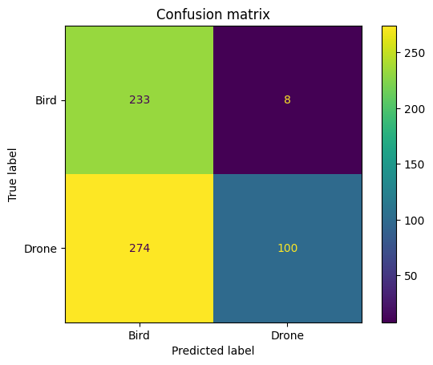
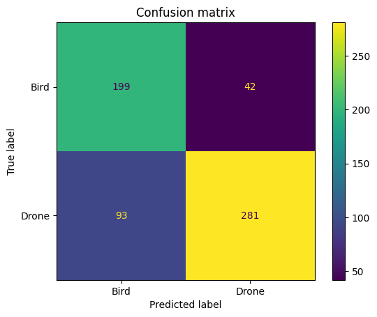
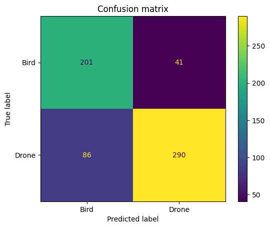
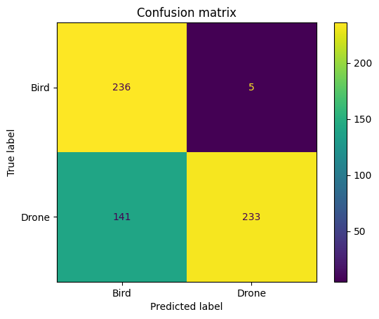

# AviDetect
Este repositorio contiene la documentación, dataset y modelo para el proyecto del módulo de inteligencia artificial TC3002B.

# Descripción del Proyecto
En este proyecto se creará un modelo de clasificación de imágenes con la capacidad de distinguir entre drones y aves.

# Contexto
En el módulo se revisan redes neuronales de capas densas y convolutivas cuyas funciones y parámetros le permitirán al modelo aprender a partir de las imágenes.

# Descripción del dataset
El dataset utilizado es [Drone vs Bird:Aerial Object Classification Dataset](https://www.kaggle.com/datasets/muhammadsaoodsarwar/drone-vs-bird) disponible públicamente [Kaggle](https://www.kaggle.com) bajo la licencia **Apache 2.0**.

"Kaggle es una plataforma web que reúne la comunidad Data Science más grande del mundo, con más de 536 mil miembros activos en 194 países, recibe más de 150 mil publicaciones por mes, que brindan todas las herramientas y recursos más importantes para progresar al máximo en data science. Kaggle, al igual que Liora, tiene una interfaz Jupyter Notebooks personalizable y sin configuración." [1]

  
  <em>Figura 1: Dataset en Kaggle</em>

 

  
  <em>Figura 2: Imágenes en el dataset</em>

 

Existen otros datasets que contienen imágenes de drones y aves con el mismo objetivo. Este dataset se eligió puesto que algunas imágenes están en alta resolución y requiere de un espacio en disco de 1.72 GB.

Un dataset alternativo es [Drone-vs-Bird](https://www.kaggle.com/datasets/romsham/dronevsbird-foryolo) igualmente disponible en **Kaggle**, que contiene más imágenes y en alta resolución, sin embargo, requiere de 7.1 GB de espacio en disco.

# Metodología

## Separación

El dataset contiene dos carpetas con un total de 4106 imágenes: 
* bird: 1607 imágenes de aves en diversos escenarios
* drone: 2499 imágenes de drones en diversos escenarios

Primero, es necesario hacer la separación del dataset en train, validation y test. Típicamente esta división es 70/15/15 u 80/10/10. Para datasets pequeños como el caso de *Drone vs Bird*, preservar entre 10 y 30% para test suele estar bien. Se utilizó la librería split-folders para hacer la división en disco, finalmente se obtuvo:

* 70% para train
* 15% para validation
* 15% para test

Nota: Para que el experimento sea replicable, tanto en el split como otras técnicas se utilizó la semilla **42**. Esta semilla se usa en ocasiones como tradición de programadores y científicos de datos. Aparece de la novela de ciencia ficción de Douglas Adams: *La guía del autoestopista galáctico (1979)*. Aquí, la supercomputadora llamada *Deep Though* revela que la respuesta a la gran pregunta de "la vida, el universo y todo lo demás" es 42. Sin embargo, realmente no tiene ninguna ventaja computacional.

Tras el split, el dataset contuvo la siguiente cantidad de imágenes:
* Train
  * Bird: 1124
  * Drone: 1749
* Validation:
  * Bird: 242
  * Drone: 376
* Test: 
  * Bird: 241
  * Drone: 374

## Preprocesamiento

Dado que el dataset está desbalanceado a favor de drones, es esperable que el modelo tienda a favorecer la clase mayoritaria durante el entrenamiento. Para mitigar el desbalanceo de clases, se aplicó una estrategia de oversampling aleatorio sobre la clase minoritaria, seguida de técnicas de data augmentation orientadas a incrementar la variabilidad de ambas clases. Esta estrategia sigue enfoques similares a los propuestos por Guerrero et al. [1], donde la aumentación dirigida permitió reducir el sesgo hacia las clases mayoritarias en tareas de clasificación de imágenes.
Es importante destacar que estas transformaciones se aplicaron exclusivamente al conjunto de entrenamiento con el fin de evitar fuga de información hacia los conjuntos de validación y prueba. Por consiguiente, los conjuntos de validación y prueba se mantuvieron sin modificaciones y se utilizaron únicamente para evaluar la capacidad de generalización del modelo.

### Oversampling

Oversampling (sobremuestreo) es una técnica que duplica o genera nuevas muestras de la clase minoritaria para ayudar al modelo a aprender más patrones. [3]

  
  <em>Figura 3: Oversampling vs Undersampling</em>

 

Como primer paso para el dataset de train se realizó un método de oversampling aleatorio para balancear el dataset puesto que es sencillo de implementar. Se calcularon las imágenes faltantes y se duplicaron una vez cada una. De este modo no se perdió información.

Tras aplicar el oversampling, la cantidad de imágenes de la clase bird en el conjunto de entrenamiento se igualó a la clase drone.

### Data augmentation

En el contexto de clasificación de imágenes, data augmentation consiste en aplicar operaciones de matrices con el objetivo de aumentar el número de instancias con transformaciones. Se modificaron los ejemplos actuales para tener más variaciones que funcionen a su vez como más ejemplos.

  
  <em>Figura 4: Data augmentation</em>

 

Siguiendo la estrategia mencionada anteriormente, se aplicaron técnicas de data augmentation. Para ello, se tomaron como referencia los criterios descritos por Orzan et al. [4], quienes emplearon transformaciones geométricas para incrementar la diversidad de imágenes durante el entrenamiento. Las transformaciones aplicadas fueron las siguientes:

* Redimensionamiento (reshaping): todas las imágenes fueron redimensionadas a 224 x 224 píxeles.
* Reescalamiento: los valores de los píxeles fueron escalados a un rango de [0, 1] mediante la división de los píxeles entre 255.
* Rotaciones aleatorias: se aplicaron rotaciones entre -30 y 30 grados.
* Espejo horizontal: las imágenes fueron invertidas horizontalmente con una probabilidad aproximada de 50%.
* Traslaciones: se aplicaron desplazamientos aleatorios en los ejes X e Y de hasta +- 10 píxeles.
* Escalamiento (zoom): las imágenes fueron escaladas aleatoriamente entre 0.9 y 1.1 veces su tamaño original.

El tamaño de 224 x 224 fue tomando como referencia el trabajo de Ghazlane et al. [5], quienes emplearon imágenes de entrada con dichas dimensiones en una tarea de clasificación entre aves y drones basada en redes neuronales convolutivas.

# Modelo

## Primera iteración

Para el problema de clasificación de imágenes se utilizó una Red Neuronal Convolutiva (CNN). Estas redes están específicamente diseñadas para extraer características significativas de datos visuales complejos, como imágenes. La estructura de una CNN, consistiendo en capas convolutivas, pooling layers y capas completamente conectadas, imita el sistema visual humano para reconocer patrones y características jerárquicas. Las capas convolutivas usan operaciones para detectar características locales que son progresivamente abstraídas por las pooling layers que condensan la información. Los resultados son usados en las capas conectadas para tareas de clasificación y regresión.

  
  <em>Figura 5: Red Neuronal Convolutiva</em>

### Descripción del modelo

El modelo se basó en el presentado por Khaliki, M.Z. et al. [6] donde experimentaron con distintos modelos para un problema de clasificación en tumores cerebrales. El objetivo fue investigar el rendimiento de una red neuronal construida desde cero frente a modelos preentrenados como VGG16, VGG19, InceptionV3, EfficientNetB4, etc.
Este primer modelo fue un modelo secuencial con la siguiente arquitectura:

* Conv2D layer: Con 32 filtros, tamaño de kernel de (3, 3), y función de activación ReLU
* Pooling layer: Con un tamaño de (2, 2).
* Conv2D layer: Con 64 filtros, tamaño de kernel de (3, 3), y función de activación ReLU
* Pooling layer: Con un tamaño de (2, 2)
* Conv2D layer: Con 128 filtros, tamaño de kernel de (3, 3), y función de activación ReLU
* Pooling layer: Con un tamaño de (2, 2)
* Capa Flatten: Convertir en un vector 1D
* Dense layer: Con 128 neuronas y función de activación ReLU
* Dense layer: Con 1 neurona y función de activación sigmoid

Hiperparámetros:
* loss: binary_crossentropy
* Epochs: 14 
* Optimizer: Adam
* Batch size: 16

Con las capas convolutivas se convierten las características de dos dimensiones (las imágenes) en matrices con las características más significativas. Las capas de pooling layer son utilizadas para reducir las dimensiones espaciales de los mapas de características, haciéndolos computacionalmente más rápidos, reduciendo el uso de memoria y previniendo sobreajuste. Se insertan típicamente después de una capa convolutiva. Posteriormente se convierten en un vector de una dimensión. Las dimensiones de ancho y alto tienden a reducirse a medida que se profundiza en la red. El número de canales de salida para cada capa Conv2D está controlado por el primer argumento. 

Esta arquitectura es similar a la presentada en la documentación de TensorFlow: [CNN TensorFlow](https://www.tensorflow.org/tutorials/images/cnn)

Con esto se evaluó si una arquitectura más simple y sin conocimiento previo era capaz de obtener buenos resultados en la clasificación de imágenes de aves y drones.

### Resultados

Los resultados fueron medidos para el mejor modelo en toda la historia de las 14 épocas.

| Métrica   | Train | Validation | Test   |
|---------- | ----- | ---------- | ------ |
| Loss      | 0.35  |   93.87    | 88.12  |
| Accuracy  | 0.84  |    0.54    | 0.53   |
| Precision |       |    0.92    | 0.93   |
| Recall    |       |    0.26    | 0.25   |
| F1-score  |       |    0.33    | 0.40   |

### Matrices de confusión

  
  <em>Figura 6: Matriz de confusión del conjunto de validación</em>

 

  
  <em>Figura 7: Matriz de confusión del conjunto de prueba</em>

 

### Conclusiones y siguientes pasos

El modelo tuvo un desempeño deficiente en la tarea de clasificación entre aves y drones. Las métricas de evaluación empleadas muestran un comportamiento consistente entre los conjuntos de validación y prueba con valores de accuracy cercanos al 50%, lo que indica una capacidad limitada al discriminar entre ambas clases. 

En los conjuntos de validación y prueba casi no se registraron Falsos positivos, lo que llevó a una precisión aproximada de 92%. Sin embargo, el recall fue muy bajo, lo que significa que la mayoría de los drones fueron clasificados erróneamente como aves.

Estos resultados implican que el modelo detecta correctamente la clase bird pero no detecta una gran cantidad de instancias de la clase drone. En consecuencia, el valor de F1-score permanece bajo, lo que revela un equilibrio deficiente.

Los resultados evidencian un problema de subajuste, ya que el rendimiento es similar en los tres conjuntos. El modelo presenta dificultades para aprender características que permitan separar adecuadamente ambas clases, es decir, su capacidad de generalización es insuficiente.

Comparándolo con el estado del arte en el problema de clasificación de aves y drones [5] [7] [8], el modelo actual no es lo suficientemente complejo para llegar a una buena solución.

Basado en estas observaciones, los siguientes pasos propuestos son incrementar la complejidad del modelo o manejo de hiperparámetros de forma que la dificultad del problema sea mejor tratada.

## Segunda iteración

### Descripción del modelo

Se partió de la arquitectura inicial, agregando cambios en la arquitectura y ajustando hiperparámetros. Para este ajuste se consideraron las conclusiones hechas S. M. Hussain et al. [9], donde destacaron la importancia de la optimización de hiperparámetros, permitiendo que un modelo con arquitectura ligera supere a modelos mucho más profundos como VGG19 o ResNet en el problema de detección de tumores cerebrales. 
El modelo tiene la siguiente arquitectura:

* Conv2D layer: Con 32 filtros, tamaño de kernel de (3, 3), y función de activación ReLU
* Pooling layer: Con un tamaño de (2, 2).
* Dropout layer: Con una tasa de 0.16
* Conv2D layer: Con 64 filtros, tamaño de kernel de (3, 3), y función de activación ReLU
* Pooling layer: Con un tamaño de (2, 2)
* Dropout layer: Con una tasa de 0.16
* Conv2D layer: Con 128 filtros, tamaño de kernel de (3, 3), y función de activación ReLU
* Pooling layer: Con un tamaño de (2, 2)
* Dropout layer: Con una tasa de 0.16
* Capa Flatten: Convertir en un vector 1D
* Dense layer: Con 128 neuronas y función de activación ReLU
* Dropout layer: Con una tasa de 0.16
* Dense layer: Con 1 neurona y función de activación sigmoid

Hiperparámetros:
* loss: binary_crossentropy
* Epochs: 14
* Optimizer: Adam
* learning rate: 0.001
* Batch size: 32

La tasa de 0.001 permitió actualizaciones de peso más precisas, proporcionando mayor estabilidad y una mejor convergencia hacia la solución global. La adición de capas dropout tiene como objetivo combatir sobreajuste en el entrenamiento, estas capas obligan a la red a aprender representaciones robustas y generalizables a datos no vistos. Se aumentó el tamaño de batch a 32, tamaños más pequeños producían resultados más inestables.

### Resultados

Los resultados fueron medidos para el mejor modelo en toda la historia de las 14 épocas.

| Métrica   | Train | Validation | Test   |
|---------- | ----- | ---------- | ------ |
| Loss      | 0.39  |   20.30    | 14.85  |
| Accuracy  | 0.80  |    0.78    | 0.79   |
| Precision |       |    0.87    | 0.87   |
| Recall    |       |    0.75    | 0.77   |
| F1-score  |       |    0.80    | 0.82   |

### Matrices de confusión

  
  <em>Figura 8: Matriz de confusión del conjunto de validación</em>

 

  
  <em>Figura 9: Matriz de confusión del conjunto de prueba</em>

 

### Conclusiones y siguientes pasos
El modelo tuvo un mejor desempeño en la tarea de clasificación entre aves y drones. Similar al modelo anterior, las métricas muestran un comportamiento similar en los conjuntos de validación y prueba, ahora con valores cercanos al 79%, lo que indica una mejor capacidad al discriminar entre ambas clases.

En los conjuntos de validación y prueba se registraron más falsos positivos, lo que llevó a una precisión aproximada de 87%. Sin embargo, en esta ocasión el recall aumentó considerablemente hasta alcanzar valores cercanos al 76%, lo que significa que hubo más drones identificados correctamente pero al mismo tiempo hubo más aves clasificadas incorrectamente.

Estos resultados implican que el modelo tiene una mejor capacidad de generalización con respecto al anterior, balanceando la tasa de falsos positivos y falsos negativos. En consecuencia, el valor de F1-score aumentó, lo que revela un equilibrio mejor.

La incorporación de dropout layers en conjunto al cambio de tamaño de batch y establecimiento de un learning rate fijo llevó a que el modelo desarrollara una mejor capacidad de generalización.

Sin embargo, comparándolo con el estado del arte en el problema de clasificación de aves y drones [5] [7] [8], el modelo continúa siendo insuficiente para llegar a una buena solución.

Basado en estas observaciones, los siguientes pasos propuestos son incrementar la complejidad del modelo mediante la incorporación de aprendizaje transferido usando alguna de las arquitecturas existentes como VGG16, VGG19, InceptionV3, ResNet, EfficientNetB4, entre otros.

## Tercera iteración
Se realizaron experimentos con los modelos preentrenados InceptionV3, ResNet50 y VGG19 [5] [6] [9], con la misma arquitectura. De los tres, VGG19 obtuvo resultados mejores y estables.

### Descripción del modelo
La arquitectura VGG se erige como un notable modelo CNN introducido por los investigadores Karen Simonyan y Andrew Zisserman en su paper *Very deep convolutional networks for large-scale image recognition*. Se basa en su predecesor, el modelo AlexNet. Ha alcanzado una precisión documentada del 90,1 % en el top-5 de los datos de ImageNet, que abarcan aproximadamente 138,4 millones de parámetros. El conjunto de datos ImageNet comprende aproximadamente 14 millones de imágenes categorizadas en 1000 clases. 

Se eligió siguiendo el enfoque de Y. Ghazlane et al. [5] donde emplearon VGG en uno de sus experimentos para la clasificación de aves y drones. Otra razón es que el modelo es más ligero a comparación de otros como DenseNet121, DenseNet201, EfficientNetB1 y EfficientNetB6. 

El modelo tiene la siguiente arquitectura:

* Modelo VGG19 con los pesos de ImageNet, congelados (no se actualizan durante el entrenamiento)
* GlobalAveragePooling2D layer: Reducir el mapa de características a un vector 1D
* Dropout layer: Con una tasa de 0.2
* Dense layer: Con 128 neuronas y función de activación ReLU
* Dropout layer: Con una tasa de 0.2
* Dense layer: Con 1 neurona y función de activación sigmoid

Hiperparámetros:
* loss: binary_crossentropy
* Epochs: 14
* Optimizer: Adam
* learning rate: 0.0001
* Batch size: 16

Para este caso ya no es necesario usar una Flatten layer.

### Resultados
Los resultados fueron medidos para el mejor modelo en toda la historia de las 14 épocas.

| Métrica   | Train | Validation | Test   |
|---------- | ----- | ---------- | ------ |
| Loss      | 0.31  |    2.19    | 1.82   |
| Accuracy  | 0.87  |    0.76    | 0.75   |
| Precision |       |    0.97    | 0.97   |
| Recall    |       |    0.62    | 0.61   |
| F1-score  |       |    0.76    | 0.75   |

### Matrices de confusión

  
  <em>Figura 10: Matriz de confusión del conjunto de validación</em>

 

  
  <em>Figura 11: Matriz de confusión del conjunto de prueba</em>

 

### Conclusiones
El modelo que obtuvo mejores resultados fue VGG19, cuyas métricas muestran un comportamiento similar en los conjuntos de validación y prueba con valores cercanos al 76%, lo que indica que su capacidad para discriminar entre ambas clases no fue mejor al modelo con arquitectura modificada.

En los conjuntos de validación y prueba casi no se registraron falsos positivos, lo que llevó a una precisión aproximada de 97%. Sin embargo, el recall decreció a valores cercanos al 62%, lo que significa que el 38% restante fueron clasificados como bird.

Estos resultados implican que el modelo con transfer learning no tuvo una mejora significativa con respecto al anterior, reduciendo significativamente los falsos positivos, pero a costa de incrementar los falsos negativos. En consecuencia, el valor de F1-score se situó alrededor de 76%, lo que revela un equilibrio moderado entre precisión y recall.

Comparándolo con el estado del arte en el problema de clasificación de aves y drones [5] [7] [8], el modelo aún es insuficiente para considerarse una solución robusta en escenarios reales.

# Discusiones
Comparando los modelos de la segunda y tercera iteración con el estado del arte del problema [5] [7] [8], el modelo no es capaz de aprender características que lo lleven a alcanzar las metricas esperadas. En este [notebook](https://www.kaggle.com/code/arifagustyawan/0-97-drone-vs-bird-classification-resnet) el autor fue capaz de alcanzar un F1-score aproximado de 96%, lo que logró usando el modelo ResNet50 con transfer learning y data augmentation (Normalización de imágenes, espejo horizontal y rotaciones). Los modelos que han tenido mejores resultados en el problema son ResNet152, DenseNet121, DenseNet201, NetB1 y EfficientNetB6 [5]. Tomando en cuenta los datasets usados y los criterios de data augmentation, es muy probale que un cambio en la forma de preprocesamiento sea más efectivo que modificar el modelo.

# Referencias
[1] Mary, "Kaggle: todo lo que hay que saber sobre esta plataforma," *Liora*, Feb. 25, 2026, [Online]. Available: https://liora.io/es/kaggle-todo-lo-que-hay-que-saber-sobre-esta-plataforma

[2] R. Escobar Díaz Guerrero, L. Carvalho, T. Bocklitz, J. Popp and J. Luis Oliveira, "A Data Augmentation Methodology to Reduce the Class Imbalance in Histopathology Images," *J. Digit. Imaging Inform. med.* vol. 37, pp. 1767–1782, 2024, doi: https://doi.org/10.1007/s10278-024-01018-9

[3] GeeksforGeeks, “Handling imbalanced data for classification,” *GeeksforGeeks*, Feb. 02, 2026. [Online]. Available: https://www.geeksforgeeks.org/machine-learning/handling-imbalanced-data-for-classification/

[4] R. I. Orzan, D. Santa, N. Lorenzovici, T. A. Zareczky, C. Pojoga, R. Agoston, E.-H. Dulf, and A. Seicean, "Deep Learning in Endoscopic Ultrasound: A Breakthrough in Detecting Distal Cholangiocarcinoma," *Cancers*, vol. 16, no. 22, Art. no. 3792, 2024, doi: https://doi.org/10.3390/cancers16223792

[5] Y. Ghazlane, M. Gmira and H. Medromi, "Development Of A Vision-based Anti-drone Identification Friend Or Foe Model To Recognize Birds And Drones Using Deep Learning," *Applied Artificial Intelligence*, vol. 38, no. 1, pp. 1–29, 2024, doi: https://doi.org/10.1080/08839514.2024.2318672

[6] M.Z. Khaliki and M.S. Başarslan, "Brain tumor detection from images and comparison with transfer learning methods and 3-layer CNN," *Scientific Reports*, vol. 14, Art. no. 2664, 2024, doi: https://doi.org/10.1038/s41598-024-52823-9

[7] H. J. Al Dawasari, M. Bilal, M. Moinuddin, K. Arshad and K. Assaleh, "DeepVision: Enhanced Drone Detection and Recognition in Visible Imagery through Deep Learning Networks," *Sensors*, vol. 23, no. 21, Art. no. 8711, 2023, doi: https://doi.org/10.3390/s23218711

[8] O. M. Elsaidy, I. A. Moneim and E. I. Abd El-Latif, "Detection and classification of UVA using double-way CNN model," *Neural Computing & Applications*, vol. 38, no. 4, pp. 1–18, 2026, doi: https://doi.org/10.1007/s00521-025-11824-z

[9] S. M. Hussain, J. S. U. Rahman, F. Akram, M. A. Asghar and R. Majid Mehmood, "Hyperparameter Optimization of Convolutional Neural Networks for Robust Tumor Image Classification," *Diagnostics*, vol. 16, no. 8, Art. no. 1215, 2026, doi: https://doi.org/10.3390/diagnostics16081215