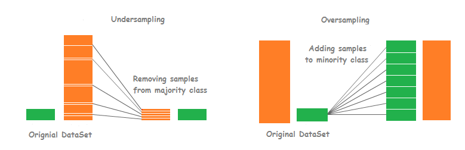
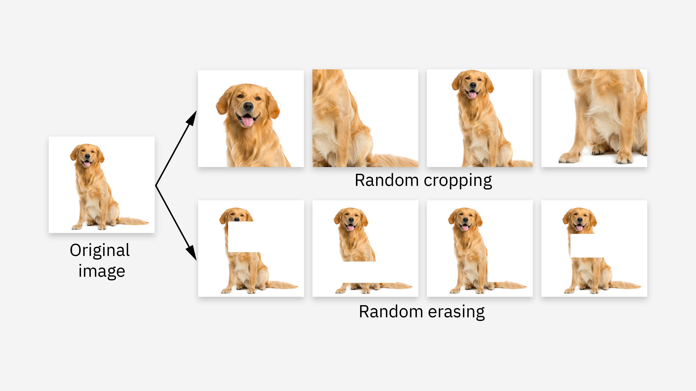
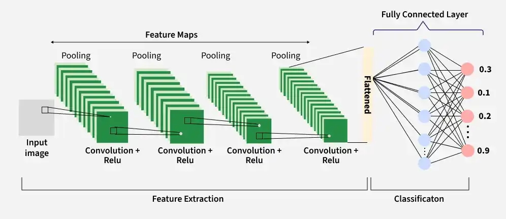

# AviDetect
Este repositorio contiene la documentación, dataset y modelo para el proyecto del módulo de inteligencia artificial TC3002B.

# Descripción del Proyecto
En este proyecto se creará un modelo de clasificación de imagenes con la capacidad de distinguir entre drones y aves.

# Contexto
En el módulo se revisan redes neurolanes de capas densas y convolutivas cuyas funciones y parámetros le permitirán al modelo a partir de las imagenes.

# Descripción del dataset
El dataset utilizado es [Drone vs Bird:Aerial Object Classification Dataset](https://www.kaggle.com/datasets/muhammadsaoodsarwar/drone-vs-bird) disponible públicamente [Kaggle](https://www.kaggle.com) bajo la licencia **Apache 2.0**.

"Kaggle es una plataforma web que reúne la comunidad Data Science más grande del mundo, con más de 536 mil miembros activos en 194 países, recibe más de 150 mil publicaciones por mes, que brindan todas las herramientas y recursos más importantes para progresar al máximo en data science. Kaggle, al igual que Liora, tiene una interfaz Jupyter Notebooks personalizable y sin configuración." [1]

  
  <em>Figura 1: Dataset en Kaggle</em>

  
  <em>Figura 2: Imágenes en el dataset</em>

Existen otros datasets que contienen imágenes de drones y aves con el mismo objetivo. Este dataset se eligió puesto que algunas imágenes están en alta resolución y requiere de un espacio en disco de 1.72 GB.

Un dataset alternativo es [Drone-vs-Bird](https://www.kaggle.com/datasets/romsham/dronevsbird-foryolo) igualmente disponible en **Kaggle**, que contiene más imágenes y en alta resolución, sin embargo, requiere de 7.1 GB de espacio en disco.

# Metodología

## Separación

El dataset contiene dos carpetas con un total de 4106 imágenes: 
* bird: 1607 imágenes de aves en diversos escenarios
* drone: 2499 imágenes de drones en diversos escenarios

Primero, es necesario hacer la separación del dataset en train, validation y test. Típicamente esta división es 70/15/15 u 80/10/10. Para datasets pequeños como el caso de *Drone vs Bird*, preservar entre 10 y 30% para test suele estar bien. Se utilizó la librería split-folders para hacer la división en disco, finalmente se obtuvo:

* 70% para train
* 15% para validation
* 15% para test

Nota: Para que el experimento sea replicable, tanto en el split como otras técnicas se utilizó la semilla **42**. Esta semilla se usa en ocasiones como tradición de programadores y científicos de datos. Aparece de la novela de ciencia ficción de Douglas Adams: *La guía del autoestopista galáctico (1979)*. Aquí, la supercomputadora llamada *Deep though* revela que la respuesta a la gran pregunta de "la vida, el universo y todo lo demás" es 42. Sin embargo, realmente no tiene ninguna ventaja computacional.

## Preprocesamiento

Dado que el dataset está desbalanceado a favor de drones, es esperable que el modelo tienda a favorecer la clase mayoritaria durante el entrenamiento. Para mitigar el desbalanceo de clases, se aplicó una estrategia de oversampling aleatorio sobre la clase minoritaria, seguida de técnicas de data augmentation orientadas a incrementar la variabilidad de ambas clases. Esta estrategia sigue enfoques similares a los propuestos por Guerrero et al. [1], donde la aumentación dirigida permitió reducir el sesgo hacia las clases mayoritarias en tareas de clasificación de imágenes.
Es importante destacar que estas transformaciones se aplicaron exclusivamente al conjunto de entrenamiento con el fin de evitar duga de información hacia los conjuntos de validación y prueba. Por consiguiente, los conjuntos de validación y prueba se mantuvieron sin modificaciones y se utilizaron únicamente para evaluar la capacidad de generalización del modelo.

### Oversampling

Oversampling (sobremuestreo) es una técnica que duplica o genera nuevas muestras de la clase minoritaria para ayudar al modelo a aprender más patrones. [3]

  
  <em>Figura 3: Oversampling vs Undersampling</em>

Como primer paso para el dataset de train se realizó un método de oversampling aleatorio para balancear el dataset puesto que es sencillo de implementar. Se calcularon las imágenes faltantes y se duplicaron una vez cada una. De este modo no se perdió información.

### Data augmentation

En el contexto de clasificación de imagenes, data augmetation consiste en aplicar operaciones de matrices con el objetivo de aumentar el número de instancias con transformaciones. Se modificaon los ejemplos actuales para tener más variaciones que funcionen a su vez como más ejemplos.

  
  <em>Figura 4: Data augmentation</em>

Siguiendo la estrategia mencionada anteriormente, se aplicaron técnicas de data augmentation. Para ello, se tomaron como referencia los criterios descritos por Orzan et al. [4], quienes emplearon transformaciones geométricas para incrementar la diversidad de imágenes durante el entrenamiento. Las transformaciones aplicadas fueron las siguientes:

* Redimensionamiento (reshaping): todas las imágenes fueron redimensionadas a 224 x 224 píxeles.
* Reescalamiento: los valores de los píxeles fueron escalados a un rango de [0, 1] mediante la división de los pixeles entre 255.
* Rotaciones aleatorias: se aplicaron rotaciones entre -30 y 30 grados.
* Espejo horizontal: las imagenes fueron invertidas horizontalmente con una probabilidad aproximada de 50%.
* Traslaciones: se aplicaron desplazamientos aleatorios en los ejes X e Y de hasta +- 10 píxeles.
* Escalamiento (zoom): las imagenes fueron escaladas aleatoriamente entre 0.9 y 1.1 veces su tamaño original.

El tamaño de 224 x 224 fue tomando como referencia el trabajo de Ghazlane et al. [5], quienes emplearon imágenes de entrada con dichas dimensiones en una tarea de clasificación entre aves y drones basada en redes neuronales convolutivas.

## Modelo

Para el problema de clasificación de imágenes se utilizó una Red Neuronal Convolutiva (CNN). Estas redes están específicamente diseñadas para extraer características significativas de datos visuales complejos, como imágenes. La estructura de una CNN, consistiendo en capas convolutivas, pooling layers y capas completamente conectadas, imita el sistema visual humano para reconocer patrones y características jerárquicas. Las capas convolutivas usan operaciones para detectar características locales que son progresivamente abstraidas por las pooling layers que condensan la información. Los resultados son usados en las capas conectadas para tareas de clasificación y regresión.

  
  <em>Figura 5: Red Neuronal Convolutiva</em>

### Descripción del modelo

El modelo se basó en el presentado por Khaliki, M.Z. et al. [6] donde experimentaron con distintos modelos para un problema de clasificación en tumores cerebrales. 
Este primer modelo fue un modelo secuencial con la siguiente arquitectura:

* Conv2D layer: Con 32 filtros, tamaño de kernel de (3, 3), y función de activación ReLU
* Pooling layer: Con un tamaño de (2, 2).
* Conv2D layer: Con 64 filtros, tamaño de kernel de (3, 3), y función de activación ReLU
* Pooling layer: Con un tamaño de (2, 2)
* Conv2D layer: Con 128 filtros, tamaño de kernel de (3, 3), y función de activación ReLU
* Pooling layer: Con un tamaño de (2, 2)
* Capa Flatten: Convertir en un vector 1D
* Dense layer: Con 128 neuronas y función de activación ReLU
* Dense layer: Con 1 neurona y función de activación sigmoid

Parámetros:
* loss: binary_crossentropy
* Epochs: 14 
* Optimizer: Adam
* Batch size: 16

Con las capas convolutivas se convierten las características de dos dimensiones (las imágenes) en matrices con las características más significativas. Pooling layer es usado para reducir las dimensiones espaciales de los mapas de características, haciéndolos computacionalmente más rápidos, reduciendo el uso de memoria y previniendo sobreajuste. Se insertan típicamente después de una capa convolutiva. Posteriormente se convierten en un vector de una dimensión. Las dimensiones de ancho y alto tienden a reducirse a medida que se profundiza en la red. El número de canales de salida para cada capa Conv2D está controlado por el primer argumento. 

Esta arquitectura es similar a la presentada en la documentación de TensorFlow: [CNN TensorFlow](https://www.tensorflow.org/tutorials/images/cnn)

# Referencias
[1] Mary, "Kaggle: todo lo que hay que saber sobre esta plataforma," *Liora*, Feb. 25, 2026, [Online]. Available: https://liora.io/es/kaggle-todo-lo-que-hay-que-saber-sobre-esta-plataforma
[2] R. Escobar Díaz Guerrero, L. Carvalho, T. Bocklitz, J. Popp and J. Luis Oliveira, "A Data Augmentation Methodology to Reduce the Class Imbalance in Histopathology Images," *J. Digit. Imaging Inform. med.* vol. 37, pp. 1767–1782, 2024, doi: https://doi.org/10.1007/s10278-024-01018-9
[3] GeeksforGeeks, “Handling imbalanced data for classification,” *GeeksforGeeks*, Feb. 02, 2026. [Online]. Available: https://www.geeksforgeeks.org/machine-learning/handling-imbalanced-data-for-classification/
[4] R. I. Orzan, D. Santa, N. Lorenzovici, T. A. Zareczky, C. Pojoga, R. Agoston, E.-H. Dulf, and A. Seicean, "Deep Learning in Endoscopic Ultrasound: A Breakthrough in Detecting Distal Cholangiocarcinoma," *Cancers*, vol. 16, no. 22, Art. no. 3792, 2024, doi: https://doi.org/10.3390/cancers16223792
[5] Y. Ghazlane, M. Gmira and H. Medromi, "Development Of A Vision- based Anti-drone Identification Friend Or Foe Model To Recognize Birds And Drones Using Deep Learning," *Applied Artificial Intelligence*, vol. 38, no. 1, pp. 1–29, 2024, doi: https://doi.org/10.1080/08839514.2024.2318672
[6] M.Z. Khaliki and M.S. Başarslan, "Brain tumor detection from images and comparison with transfer learning methods and 3-layer CNN," *Scientific Reports*, vol. 14, Art. no. 2664, 2024, doi: https://doi.org/10.1038/s41598-024-52823-9
[7] H. J. Al Dawasari, M. Bilal, M. Moinuddin, K. Arshad and K. Assaleh, "DeepVision: Enhanced Drone Detection and Recognition in Visible Imagery through Deep Learning Networks," *Sensors*, vol. 23, no. 21, Art. no. 8711, 2023, doi: https://doi.org/10.3390/s23218711
[8] O. M. Elsaidy, I. A. Moneim and E. I. Abd El-Latif, "Detection and classification of UVA using double-way CNN model," *Neural Computing & Applications*, vol. 38, no. 4, pp. 1–18, 2026, doi: https://doi.org/10.1007/s00521-025-11824-z
[9] A. Galdran, G. Carneiro and M.A. González Ballester, "Balanced-MixUp for Highly Imbalanced Medical Image Classification," in *Medical Image Computing and Computer Assisted Intervention – MICCAI 2021*, M. de Bruijne et al., Eds., vol. 12905, *Lecture Notes in Computer Science*, Cham, Springer, 2021, doi: https://doi.org/10.1007/978-3-030-87240-3_31