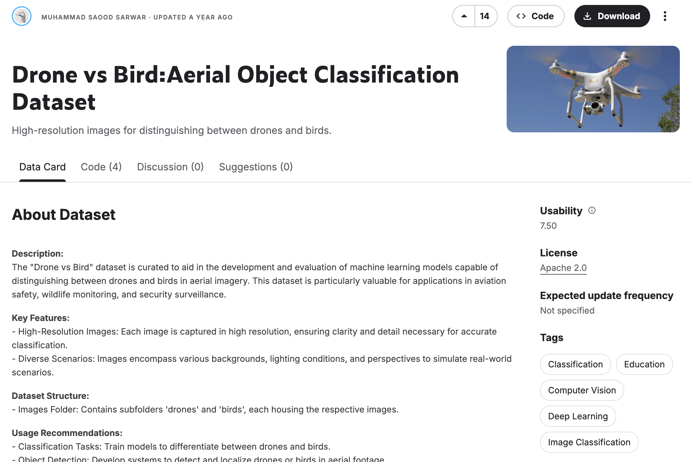
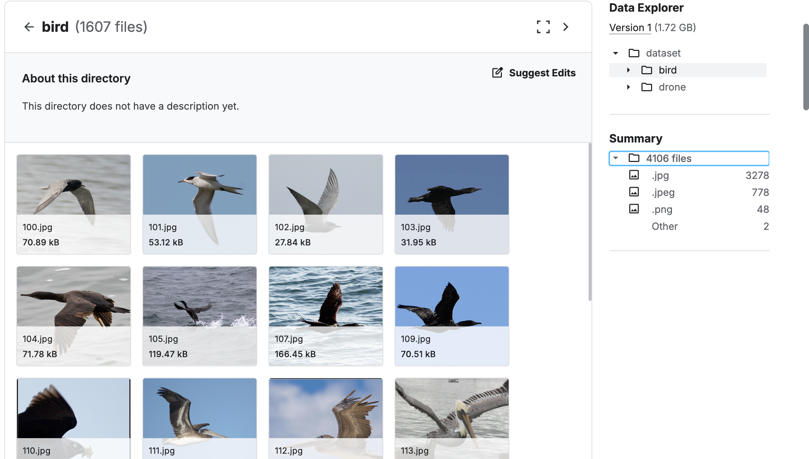

# AviDetect
Este repositorio contiene la documentación, dataset y modelo para el proyecto del módulo de inteligencia artificial TC3002B.

# Descripción del Proyecto
En este proyecto se creará un modelo de clasificación de imagenes con la capacidad de distinguir entre drones y aves.

# Contexto
En el módulo se revisan redes neurolanes de capas densas y convolutivas cuyas funciones y parámetros le permitirán al modelo a partir de las imagenes.

# Descripción del dataset
El dataset utilizado es [Drone vs Bird:Aerial Object Classification Dataset](https://www.kaggle.com/datasets/muhammadsaoodsarwar/drone-vs-bird) disponible públicamente [Kaggle](https://www.kaggle.com) bajo la licencia **Apache 2.0**.

"Kaggle es una plataforma web que reúne la comunidad Data Science más grande del mundo, con más de 536 mil miembros activos en 194 países, recibe más de 150 mil publicaciones por mes, que brindan todas las herramientas y recursos más importantes para progresar al máximo en data science. Kaggle, al igual que Liora, tiene una interfaz Jupyter Notebooks personalizable y sin configuración." (Mary, 2026) 

El dataset contiene dos carpetas con un total de 4106 imágenes: 
* bird: 1607 imágenes de aves en diversos escenarios
* drone:  2499 imágenes de drones en diversos escenarios

  
  <em>Figura 1: Dataset en Kaggle</em>

  
  <em>Figura 2: Imágenes en el dataset</em>

Existen otros datasets que contienen imágenes de drones y aves con el mismo objetivo. Este dataset se eligió puesto que algunas imágenes están en alta resolución y requiere de un espacio en disco de 1.72 GB.

Un dataset alternativo es [Drone-vs-Bird](https://www.kaggle.com/datasets/romsham/dronevsbird-foryolo) igualmente disponible en **Kaggle**, que contiene más imágenes y en alta resolución, sin embargo, requiere de 7.1 GB de espacio en disco.

# Referencias
Mary. (2026, February 25). Kaggle: todo lo que hay que saber sobre esta plataforma. Liora. https://liora.io/es/kaggle-todo-lo-que-hay-que-saber-sobre-esta-plataforma